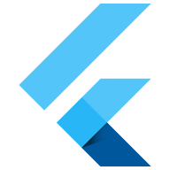

# Sentra Robot

<p align="center">
  
</p>

Sentra is an advanced, modular ESP32-based robotics platform. It features AI-powered voice control via BLE, a modern Flutter mobile application, and a high-performance power delivery system designed for stability and torque.

## Hardware Specifications

### 1. Control & Logic (The Brain)
- **Microcontroller:** ESP32 S3 — A dual-core processor managing BLE communication and motor control.
- **Display:** 0.96" OLED (SSD1306) — Real-time system monitoring (Status, Connection, and Command feedback) via I2C protocol.

### 2. Power Management
- **Main Battery:** 11.1V 3-Cell (3S) LiPo Battery — Provides the high current and voltage needed for maximum motor performance.
- **Voltage Regulation:** DC-DC Buck Converter (LM2596) — Steps down the 11.1V battery voltage to a stable 5V to power the logic side (ESP32 & OLED).

### 3. Motion & Actuation
- **Motor Driver:** L298N Dual H-Bridge Module — Interfaces the 11.1V power rail with the ESP32 logic to drive the motors.
- **Drive System:** 4-Wheel Drive (4WD) — Powered by four high-torque gear DC motors.

## Connectivity & Control

### BLE Control (Primary)

The ESP32 communicates with the Flutter app via Bluetooth Low Energy:

- **WiFi Configuration** — Initial SSID/Password setup via BLE
- **Voice Commands** — User speaks Egyptian Arabic → Flutter app STT → BLE → ESP32 → OpenRouter AI → JSON motor commands
- **Voice Responses** — AI reply sent back to app via BLE for TTS playback
- **Error Reporting** — Real-time error codes streamed to app
- **Live Debugging** — System heap, RSSI, and uptime via BLE characteristics

### Command Flow

```
User Voice → Flutter STT → BLE → ESP32 → OpenRouter AI → JSON Response → Motors
                                                         ↓
                                              BLE ← Reply → Flutter TTS
```

## Features

- **AI Voice Commands:** DeepSeek NLP model processes Egyptian Arabic and returns structured motor commands.
- **Heartbeat Safety System:** Automatically stops motors if no command received for 5 seconds.
- **Persistent Memory:** Saves WiFi credentials in ESP32 Preferences (NVS) to survive power cycles.
- **Live Debugging:** Streams system heap, RSSI, and uptime via BLE characteristics.

## Pin Mapping

| Pin | Component |
|-----|-----------|
| GPIO14 | Motor IN1 |
| GPIO27 | Motor IN2 |
| GPIO26 | Motor IN3 |
| GPIO25 | Motor IN4 |
| GPIO21 | OLED SDA |
| GPIO22 | OLED SCL |

## Build

### ESP32 Firmware
```bash
pio run              # Build
pio run -t upload    # Upload to ESP32
pio device monitor   # Serial monitor
```

### Flutter App
```bash
cd app
flutter pub get      # Install deps
flutter analyze      # Lint check
flutter run          # Run on device
flutter build apk    # Build release APK
```

## License

Sentra is licensed under the [GNU General Public License v3.0](LICENSE) (GPLv3).
